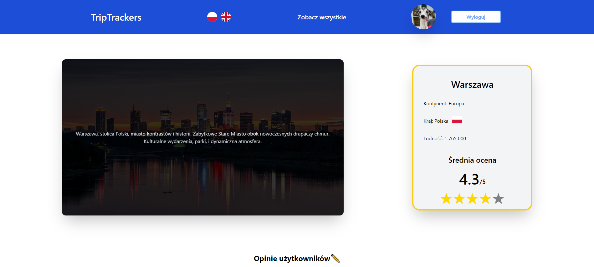
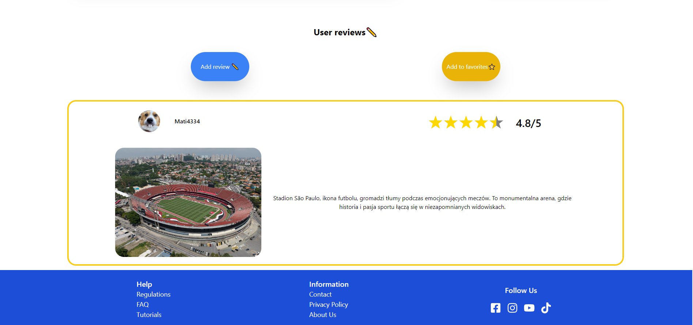
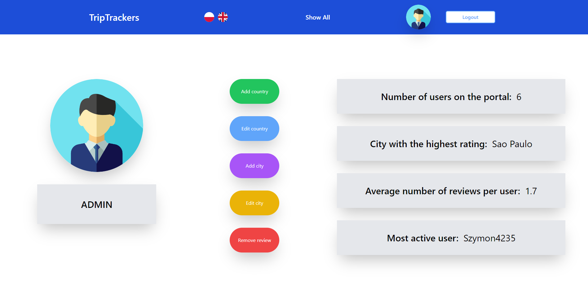

# TripTrackers
A portal for travelers to leave their opinions and ratings about cities around the world

Tech Stack:

Frontend: React.js Tailwind

Backend: Springboot

Database: MySql

# The project includes:
* Internationalization
* User and Admin Accounts
* Ability to Add and Delete Reviews
* Adding and Removing Favorites
* Adding/Editing Cities and Countries (admin)
* Responsive view adapted to mobile phones
* Form Validation
* User Data Editing
* Authorization using JWT Token
* Pagination, filtering, sorting of cities
* City Search Engine

## MainPage

## CityPage

## Filters

## Reviews

## UserAccount

## AdminAccount

